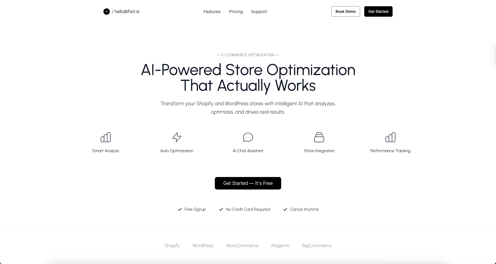

# Fix It AI - E-commerce Assistant

An AI-powered assistant that connects to Shopify & WordPress to scan, fix, and verify issues in e-commerce sites. Understand user commands in plain language, suggest fixes with preview diffs, and apply them safely.



## Features

### AI-Powered Chat Interface
- **Natural Language Processing**: Describe issues in plain English
- **Streaming Responses**: Real-time AI responses using Grok API
- **Context Awareness**: AI understands your store structure and suggests relevant fixes

### Shopify Integration
- **Product Management**: Update product tags, descriptions, and pricing
- **Theme Editing**: Modify theme files and assets
- **Discount Creation**: Set up automatic discounts and promotions
- **Shipping Configuration**: Manage shipping zones and rates
- **Metafields**: Customize product and collection metadata

### WordPress Integration
- **Content Management**: Update posts, pages, and custom post types
- **SEO Optimization**: Improve meta descriptions, titles, and structured data
- **Plugin Management**: Activate/deactivate plugins safely
- **Theme Customization**: Modify theme files and options
- **Performance**: Optimize site speed and performance

### Smart Analysis
- **Lighthouse Audits**: Performance, accessibility, and SEO analysis
- **Store Scanning**: Comprehensive analysis of your store structure
- **Issue Detection**: Identify common e-commerce problems
- **Recommendations**: AI-powered suggestions for improvements

### Safety & Control
- **Preview Changes**: See exactly what will be changed before applying
- **Rollback System**: Revert any changes with one click
- **Change Logging**: Complete audit trail of all modifications
- **Dry Run Mode**: Test changes without affecting your live store

## Example Commands

### Shopify
- "Make all discounted products show a red badge"
- "Exclude discounted items from free shipping in Canada"
- "Add a 'New Arrival' tag to products created in the last 7 days"
- "Update the product page template to show customer reviews"
- "Create a 20% discount for first-time customers"

### WordPress
- "Fix my homepage SEO basics"
- "Speed up my WordPress homepage"
- "Add schema markup to my product pages"
- "Optimize images for better performance"
- "Update the contact page with new information"

## Installation

### Prerequisites
- Node.js 18+ 
- npm or yarn
- Grok API key
- Shopify/WordPress credentials

### Setup

1. **Clone the repository**
   ```bash
   git clone <repository-url>
   cd fixit-ai
   ```

2. **Install dependencies**
   ```bash
   npm install
   ```

3. **Set up environment variables**
   ```bash
   cp env.example .env.local
   ```
   
   Edit `.env.local` with your credentials:
   ```env
   # Database
   DATABASE_URL="file:./dev.db"
   
   # AI API
   GROK_API_KEY="your-grok-api-key-here"
   
   # Shopify Configuration
   SHOPIFY_STORE_URL="your-shopify-store.myshopify.com"
   SHOPIFY_ACCESS_TOKEN="your-shopify-access-token"
   
   # WordPress Configuration
   WP_BASE_URL="https://your-wordpress-site.com"
   WP_USERNAME="your-wordpress-username"
   WP_APP_PASSWORD="your-wordpress-app-password"
   ```

4. **Set up the database**
   ```bash
   npm run db:generate
   npm run db:push
   ```

5. **Start the development server**
   ```bash
   npm run dev
   ```

6. **Open your browser**
   Navigate to [http://localhost:3000](http://localhost:3000)

## Configuration

### Shopify Setup
1. Create a private app in your Shopify admin
2. Set required scopes:
   - `read_products, write_products`
   - `read_themes, write_themes`
   - `read_shipping, write_shipping`
   - `read_discounts, write_discounts`
   - `read_metafields, write_metafields`
3. Copy the access token to your `.env.local`

### WordPress Setup
1. Enable REST API in your WordPress site
2. Create an application password:
   - Go to Users → Profile
   - Scroll to "Application Passwords"
   - Generate a new password
3. Add credentials to your `.env.local`

### Grok API Setup
1. Sign up for Grok API access
2. Get your API key from the dashboard
3. Add to your `.env.local`

## Project Structure

```
fixit-ai/
├── src/
│   ├── app/                    # Next.js App Router pages
│   │   ├── page.tsx           # Main chat interface
│   │   ├── settings/          # Store connection settings
│   │   └── logs/              # Change history and rollback
│   ├── components/            # React components
│   │   ├── ChatBox.tsx        # Chat interface
│   │   ├── ChangePreview.tsx  # Change preview panel
│   │   ├── Sidebar.tsx        # Navigation sidebar
│   │   └── ui/                # Reusable UI components
│   ├── lib/                   # Utility libraries
│   │   ├── shopify.ts         # Shopify API integration
│   │   ├── wordpress.ts       # WordPress API integration
│   │   ├── lighthouse.ts      # Performance analysis
│   │   ├── store.ts           # Zustand state management
│   │   └── utils.ts           # Utility functions
│   └── pages/api/             # API routes
│       ├── chat.ts            # AI chat endpoint
│       ├── shopify/           # Shopify API endpoints
│       ├── wordpress/         # WordPress API endpoints
│       └── logs.ts            # Change logging
├── prisma/                    # Database schema
├── public/                    # Static assets
└── package.json
```

## API Endpoints

### Chat
- `POST /api/chat` - Send messages to AI assistant

### Shopify
- `POST /api/shopify/scan` - Scan store data
- `POST /api/shopify/apply` - Apply changes
- `POST /api/shopify/test` - Test connection

### WordPress
- `POST /api/wordpress/scan` - Scan site data
- `POST /api/wordpress/apply` - Apply changes
- `POST /api/wordpress/test` - Test connection

### Logs
- `GET /api/logs` - Get change history
- `POST /api/logs` - Log new changes

## Customization

### Adding New AI Models
The application supports multiple AI providers. To add a new model:

1. Update the chat API in `src/pages/api/chat.ts`
2. Add model configuration to environment variables
3. Update the system prompt for your use case

### Extending Platform Support
To add support for other e-commerce platforms:

1. Create a new API integration in `src/lib/`
2. Add API routes in `src/pages/api/`
3. Update the chat system prompt
4. Add platform-specific components

### Custom Actions
Create custom actions by:

1. Adding new API endpoints
2. Updating the AI system prompt
3. Creating platform-specific handlers
4. Adding UI components for new features

## Deployment

### Vercel (Recommended)
1. Connect your GitHub repository to Vercel
2. Set environment variables in Vercel dashboard
3. Deploy automatically on push to main branch

### Docker
```bash
# Build the image
docker build -t fixit-ai .

# Run the container
docker run -p 3000:3000 fixit-ai
```

### Self-Hosted
1. Build the application: `npm run build`
2. Start the production server: `npm start`
3. Set up a reverse proxy (nginx recommended)
4. Configure SSL certificates

## Security

### API Key Management
- Store all API keys in environment variables
- Never commit secrets to version control
- Use different keys for development and production
- Rotate keys regularly

### Data Protection
- All API calls are made server-side
- No sensitive data is stored in the browser
- Database is encrypted at rest
- HTTPS is required in production

### Access Control
- Implement user authentication (future feature)
- Role-based access control
- Audit logging for all actions
- Rate limiting on API endpoints

## Contributing

1. Fork the repository
2. Create a feature branch: `git checkout -b feature-name`
3. Make your changes
4. Add tests for new functionality
5. Commit your changes: `git commit -m 'Add feature'`
6. Push to the branch: `git push origin feature-name`
7. Submit a pull request

## License

This project is licensed under the MIT License - see the [LICENSE](LICENSE) file for details.

## Support

- **Documentation**: [docs.fixit-ai.com](https://docs.fixit-ai.com)
- **Issues**: [GitHub Issues](https://github.com/your-org/fixit-ai/issues)
- **Discord**: [Join our community](https://discord.gg/fixit-ai)
- **Email**: support@fixit-ai.com

## Acknowledgments

- Built with [Next.js](https://nextjs.org/)
- AI powered by [Grok](https://grok.x.ai/)
- UI components with [Tailwind CSS](https://tailwindcss.com/)
- State management with [Zustand](https://zustand-demo.pmnd.rs/)
- Database with [Prisma](https://www.prisma.io/)

---

**Fix It AI** - Making e-commerce management effortless with AI.
